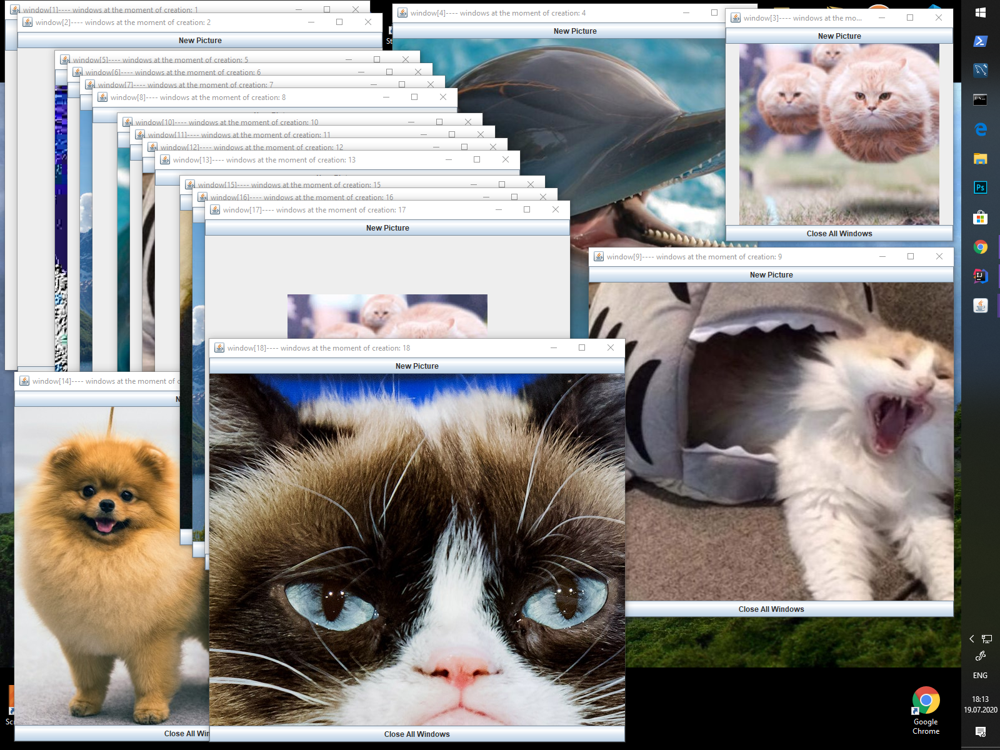

# Java swing application

The way it looks like



## Launching

```
1) mvn -o clean install
2) java -jar -Dapple.awt.UIElement="true" target/desktopApp1-1.0-SNAPSHOT.jar -h
```

Pressing the "New Picture" button opens a new window with a random image from Enum src/main/java/com/gqoitic/desktopApp1/Image.java
